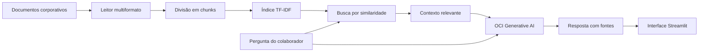

# CorpMind AI — Challenge Alura Agentes

Agente corporativo de inteligência artificial capaz de responder perguntas de colaboradores com base em documentos internos da empresa.

O projeto utiliza uma arquitetura RAG (Retrieval-Augmented Generation): os documentos são convertidos em texto, divididos em trechos, pesquisados por relevância e enviados como contexto para um modelo disponível no OCI Generative AI.

## Objetivo

Centralizar informações corporativas em uma interface conversacional simples, permitindo consultas sobre políticas, procedimentos, benefícios, despesas, suporte e outros documentos internos.

## Funcionalidades

- Chat corporativo em Streamlit.
- Upload de múltiplos documentos.
- Leitura de PDF, Word, Excel, PowerPoint, Markdown, TXT, CSV, JSON e HTML.
- Base de conhecimento com documentos fictícios já incluídos.
- Divisão dos documentos em trechos para recuperação contextual.
- Busca por similaridade usando TF-IDF e similaridade de cosseno.
- Geração de respostas com OCI Generative AI.
- Exibição das fontes utilizadas na recuperação.
- Regra para não inventar respostas quando a informação não estiver nos documentos.
- Aplicação preparada para Docker e OCI Container Instances.

## Arquitetura



## Tecnologias

- Python
- Streamlit
- pandas
- scikit-learn
- PyPDF
- python-docx
- openpyxl
- python-pptx
- BeautifulSoup
- OCI Generative AI
- Docker
- Oracle Cloud Infrastructure

## Estrutura do projeto

```text
desafio4-agente-corporativo-ia/
├── app.py
├── Dockerfile
├── requirements.txt
├── .env.example
├── src/
│   ├── document_loader.py
│   ├── rag.py
│   └── oci_llm.py
├── documents/
│   ├── politica_beneficios.md
│   ├── politica_despesas.csv
│   └── faq_ti.json
└── deploy/
    └── README_OCI.md
```

## Como executar localmente

### 1. Criar o ambiente virtual

```bash
python -m venv .venv
```

### 2. Ativar o ambiente

Windows:

```bash
.venv\Scripts\activate
```

Linux/macOS:

```bash
source .venv/bin/activate
```

### 3. Instalar as dependências

```bash
pip install -r requirements.txt
```

### 4. Configurar o OCI Generative AI

Copie `.env.example` para `.env` e preencha os valores apresentados na área **How to use / Como usar** do seu projeto no OCI Generative AI.

```env
OCI_GENAI_BASE_URL=https://inference.generativeai.<regiao>.oci.oraclecloud.com/openai/v1
OCI_GENAI_API_KEY=sua_chave
OCI_GENAI_PROJECT_OCID=ocid_do_projeto
OCI_GENAI_MODEL=modelo_disponivel_no_seu_projeto
```

O arquivo `.env` está no `.gitignore` e não deve ser enviado ao GitHub.

### 5. Iniciar a aplicação

```bash
streamlit run app.py
```

## Documentos de demonstração

A empresa fictícia usada no projeto se chama **Nexora Tecnologia**.

A base inicial possui documentos sobre:

- Benefícios e Recursos Humanos.
- Política de despesas e reembolsos.
- Perguntas frequentes de suporte de TI.

Também é possível enviar arquivos adicionais diretamente pela interface.

## Exemplos de perguntas

- Qual é o valor do vale-alimentação?
- Quanto a empresa oferece de auxílio home office?
- Qual é o limite de hospedagem em uma viagem corporativa?
- Com quantos dias de antecedência devo solicitar minhas férias?
- Como faço para solicitar acesso a um sistema interno?
- Posso instalar qualquer programa no computador corporativo?

## Exemplos de respostas esperadas

**Pergunta:** Qual é o valor do vale-alimentação?

**Resposta esperada:** O vale-alimentação é de R$ 720,00 por mês e o crédito ocorre até o quinto dia útil de cada mês. Fonte: `politica_beneficios.md`.

**Pergunta:** Qual é o limite de hospedagem em uma viagem corporativa?

**Resposta esperada:** O limite é de R$ 450 por diária, com aprovação do gestor direto. Fonte: `politica_despesas.csv`.

**Pergunta:** Qual é a política de estacionamento da empresa?

**Resposta esperada:** O agente deve informar que essa informação não foi encontrada nos documentos disponíveis, em vez de inventar uma resposta.

## Fluxo RAG

1. O sistema carrega os documentos internos.
2. Cada arquivo é convertido em texto de acordo com seu formato.
3. O texto é dividido em trechos menores.
4. Os trechos são indexados usando TF-IDF.
5. A pergunta do usuário é comparada aos trechos por similaridade de cosseno.
6. Os trechos mais relevantes formam o contexto da pergunta.
7. O contexto e a pergunta são enviados ao OCI Generative AI.
8. O modelo gera uma resposta limitada às informações encontradas.

## Deploy na OCI

O projeto possui um `Dockerfile` para publicação em container. O guia detalhado está em [`deploy/README_OCI.md`](deploy/README_OCI.md).

Serviços OCI previstos na solução:

- **OCI Generative AI:** geração das respostas do agente.
- **OCI Container Instances:** hospedagem da aplicação Docker.
- **OCI Container Registry:** armazenamento da imagem do projeto.

## Evidência do deploy

Antes da entrega final do Challenge, adicionar nesta seção:

- URL pública da aplicação: `PENDENTE_DEPLOY_OCI`
- Captura de tela da aplicação executando na OCI: `PENDENTE_PRINT_OCI`

A captura deve mostrar o agente online respondendo a uma pergunta baseada nos documentos.

## Segurança

- Nenhuma credencial está armazenada no código.
- Segredos são lidos por variáveis de ambiente.
- O agente é instruído a não inventar políticas ou dados ausentes.
- O projeto não implementa restrição por usuário porque o Challenge define o agente como aberto aos colaboradores da empresa hipotética.

## Requisitos do Challenge atendidos

- [x] Código-fonte organizado em repositório GitHub.
- [x] Agente baseado em documentos.
- [x] Processamento de PDF e CSV, além de outros formatos.
- [x] README com descrição, arquitetura, tecnologias, execução e exemplos.
- [x] Integração preparada com OCI Generative AI.
- [x] Dockerfile e instruções para execução na OCI.
- [ ] Realizar o deploy em uma conta OCI.
- [ ] Inserir URL pública e captura de tela do deploy no README.

## Autor

Pedro Paulo Lima Carneiro

Projeto desenvolvido para o Challenge Alura Agentes / Oracle Next Education.
